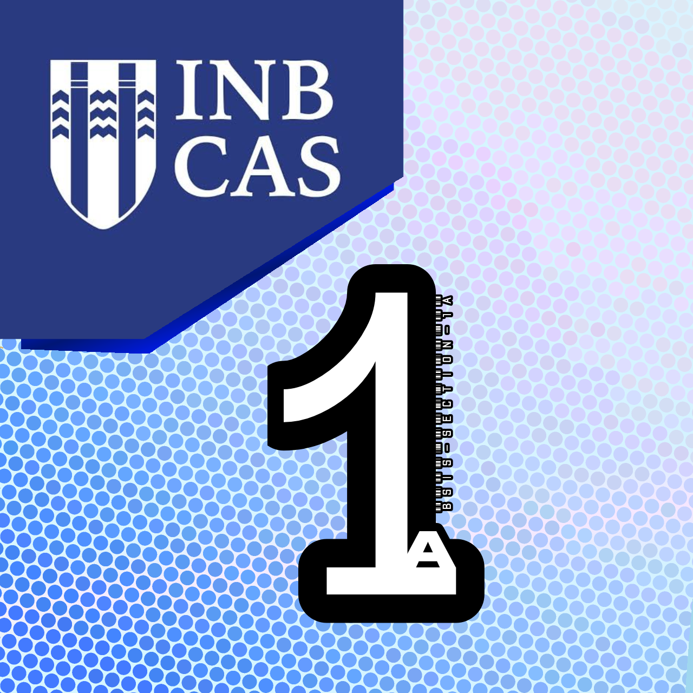

<p align="center">
  
</p>

<h1 align="center">CC102 Reference repository for 1A</h1>

<p align="center">
  A shared repository of hands-on activities for classmates, by classmates.
</p>

---

## 📖 About

This repository documents the hands-on activities for **CC102 - Computer Programming**, taught by **Sir [Mark Ryan Hilario](https://github.com/bluery0206/)**. It is dedicated to my classmates: use it to compare notes, get unstuck, and learn alongside each other.

> ⚠️ **Notice:** This is **not an official repository of the Instructor, nor of Inabanga College of Arts and Sciences**. It is a student-made resource and is not endorsed, reviewed, or maintained by the school or the instructor. For official course requirements, announcements, and grading, always follow the Instructor's instructions. [CC102 1A repo by the Instructor.](https://github.com/bluery0206/cc102-2026)

> **Heads-up:** Please try each activity yourself first. Use this repo to check your understanding, not to copy and paste.

---

## 🧒 `eli5` (Explain Like I'm 5)

Confused by a Python term, function, or concept in the activities? Check the **ELI5 reference sheet**. It explains what various Python things do in plain, simple language.

👉 [Check out the `eli5` README](eli5/python.md)

---

## 🚀 `techstart` Heads up

**TechStart** is a branch of this repo that stores guides for setting up a development environment on different devices, so you can get coding before the activity even begins.

👉 [Check out the `techstart` README](eli5/python.md)

---

## 🗂 `main` Branch Structure

```
cc102/
├── assets/          # Images used in docs
├── techstart/       # Dev environment setup guides
├── eli5/            # Plain-language Python reference sheet
├── activities/      # Hands-on activities
│   ├── 01-.../
│   └── 02-.../
└── README.md
```
---

## 🤝 Contributing

Classmates are welcome to contribute!

1. Fork the repo or create a branch.
2. Make your changes and commit with a clear message.
3. Open a pull request describing what you changed.

---

## 📬 Contact

Questions or corrections? Open an [issue](https://github.com/mchnjt/cc102/issues).

<p align="center"><sub>Made for CC102 classmates 💙</sub></p>
